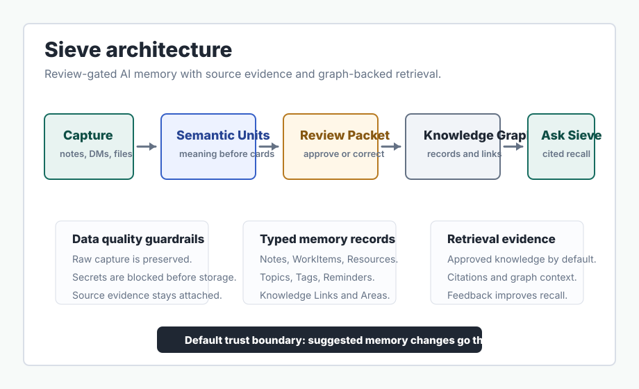

# Sieve

Sieve is an AI knowledge and memory workspace built around a practical loop: capture messy input, extract useful memory candidates, review what changes, and ask Sieve for cited recall later.

Source private during active development; technical walkthrough available on request.

[Portfolio case study](https://stickkb.github.io/projects/sieve.html)

## 20-second summary

Sieve turns rough thoughts, messages, links, files, and conversations into reviewable personal memory. It preserves the original capture, proposes structured knowledge changes, and retrieves approved knowledge with source evidence.

## Product problem

Most personal knowledge tools either store raw dumps that become hard to reuse or let AI rewrite memory too aggressively. Sieve treats memory as a data-quality problem: preserve raw input, interpret it into useful units, make proposed changes reviewable, and keep evidence available for trust and debugging.

## AI/data workflow

1. Capture rough input from notes, conversations, files, links, or Discord DMs.
2. Interpret the capture into semantic units before creating review candidates.
3. Assemble a review packet with notes, work items, resources, reminders, tags, and knowledge links.
4. Approve, reject, refine, lock, or undo candidate changes.
5. Ask Sieve questions against approved knowledge with citations, graph context, and source evidence.

## Architecture

The system uses a React/Vite dashboard, TypeScript/Node API service, OpenAPI contract, generated client packages, Supabase/Postgres, Drizzle, row-level ownership hardening, pgvector-backed retrieval, and OpenAI-backed extraction and retrieval helpers.

The core trust boundary is review: AI can propose memory changes, but user approval determines what becomes durable knowledge.

## Safe data/API overview

The public-safe model is category-level:

- Intake and capture records.
- Review packets and review candidates.
- Approved knowledge nodes and subtype records.
- Work items and derived project views.
- Source documents, source chunks, and source evidence.
- Graph links, local graph context, and edge evidence.
- Search and retrieval events with feedback.
- Usage, settings, export, account deletion, and Discord pairing surfaces.

Raw endpoint specs, schema definitions, policies, and source code stay private.

## What I built

I shaped the product and implementation around shared domain concepts: Capture, Semantic Unit, Review Packet, Review Candidate, WorkItem, Knowledge Link, Source Evidence, and Ask Sieve. That language connects the UI, API, data model, and verification strategy.

## Verification

Verification covers model behavior, review-packet shape, candidate mutation, source evidence, graph-backed retrieval, generated API clients, dashboard route contracts, typechecking, and browser QA where local authentication gates allow it.

## Trade-offs

- Review-first memory is slower than silent auto-save, but it preserves trust.
- Postgres plus graph-style records is simpler to operate than adding a separate graph database.
- Collapsed source evidence keeps the default UI clean while preserving provenance.
- Category-level public documentation proves the system shape without exposing source code.

## Current rough edges

- Ask Sieve is still moving from retrieval inspection toward a more conversational cited-answer surface.
- Review needs more grouping around what will change in memory.
- Public demo media is pending because the walkthrough must avoid private data and active source.

## Roadmap

1. Unify capture for notes, source imports, files, and Discord DMs.
2. Turn retrieval into an Ask Sieve chatbot with citations and evidence controls.
3. Simplify Review around proposed memory changes.
4. Make knowledge detail, graph, and source evidence contextual.
5. Add evaluation coverage for capture quality, review usefulness, and grounded retrieval answers.

## Demo media pending

Planned demo: a 60-90 second walkthrough showing capture, AI extraction, review packet approval, Ask Sieve retrieval, and source evidence. Until that recording is safe to publish, this README uses architecture and workflow evidence instead of media claims.
